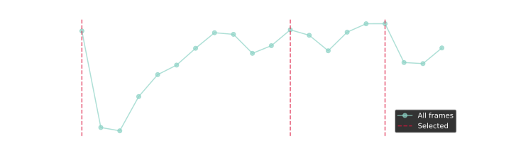

# Quality-Based Stream Filtering

When processing sensor streams, you often want to reduce frequency while keeping the best quality data. Instead of blindly dropping frames, `quality_barrier` selects the highest quality item within each time window.

## The Problem

A camera outputs 30fps, but your ML model only needs 2fps. Simple approaches:

- **`sample(0.5)`** - Takes whatever frame happens to land on the interval tick
- **`throttle_first(0.5)`** - Takes the first frame, ignores the rest

Both ignore quality. You might get a blurry frame when a sharp one was available.

## The Solution: `quality_barrier`

```python session=qb
import reactivex as rx
from reactivex import operators as ops
from dimos.utils.reactive import quality_barrier

# Simulated sensor data with quality scores
data = [
    {"id": 1, "quality": 0.3},
    {"id": 2, "quality": 0.9},  # best in first window
    {"id": 3, "quality": 0.5},
    {"id": 4, "quality": 0.2},
    {"id": 5, "quality": 0.8},  # best in second window
    {"id": 6, "quality": 0.4},
]

source = rx.of(*data)

# Select best quality item per window (2 items per second = 0.5s windows)
result = source.pipe(
    quality_barrier(lambda x: x["quality"], target_frequency=2.0),
    ops.to_list(),
).run()

print("Selected:", [r["id"] for r in result])
print("Qualities:", [r["quality"] for r in result])
```

<!--Result:-->
```
Selected: [2]
Qualities: [0.9]
```

## Image Sharpness Filtering

For camera streams, we provide `sharpness_barrier` which uses the image's sharpness score.

Let's use real camera data from the Unitree Go2 robot to demonstrate. We use the [Sensor Replay](/docs/old/testing_stream_reply.md) toolkit which provides access to recorded robot data:

```python session=qb
from dimos.utils.testing import TimedSensorReplay
from dimos.msgs.sensor_msgs.Image import Image, sharpness_barrier

# Load recorded Go2 camera frames
video_replay = TimedSensorReplay("unitree_go2_bigoffice/video")

# Use stream() with seek to skip blank frames, speed=10x to collect faster
input_frames = video_replay.stream(seek=5.0, duration=1.4, speed=10.0).pipe(
    ops.to_list()
).run()

def show_frames(frames):
   for i, frame in enumerate(frames[:10]):
      print(f"  Frame {i}: {frame.sharpness:.3f}")

print(f"Loaded {len(input_frames)} frames from Go2 camera")
print(f"Frame resolution: {input_frames[0].width}x{input_frames[0].height}")
print("Sharpness scores:")
show_frames(input_frames)
```

<!--Result:-->
```
Loaded 20 frames from Go2 camera
Frame resolution: 1280x720
Sharpness scores:
  Frame 0: 0.351
  Frame 1: 0.227
  Frame 2: 0.223
  Frame 3: 0.267
  Frame 4: 0.295
  Frame 5: 0.307
  Frame 6: 0.328
  Frame 7: 0.348
  Frame 8: 0.346
  Frame 9: 0.322
```

Using `sharpness_barrier` to select the sharpest frames:

```python session=qb
# Create a stream from the recorded frames

sharp_frames = video_replay.stream(seek=5.0, duration=1.5, speed=1.0).pipe(
    sharpness_barrier(2.0),
    ops.to_list()
).run()

print(f"Output: {len(sharp_frames)} frame(s) (selected sharpest per window)")
show_frames(sharp_frames)
```

<!--Result:-->
```
Output: 3 frame(s) (selected sharpest per window)
  Frame 0: 0.351
  Frame 1: 0.352
  Frame 2: 0.360
```

Visualizing which frames were selected:

<details><summary>Python</summary>

```python fold session=qb output=assets/frame_mosaic.jpg
import matplotlib
matplotlib.use('Agg')
import matplotlib.pyplot as plt

cols, rows = 5, 4
aspect = input_frames[0].width / input_frames[0].height
fig_w = 12
fig_h = fig_w * rows / (cols * aspect)

fig, axes = plt.subplots(rows, cols, figsize=(fig_w, fig_h))
fig.patch.set_facecolor('black')

for i, ax in enumerate(axes.flat):
    if i < len(input_frames):
        frame = input_frames[i]
        ax.imshow(frame.data)
        is_selected = frame in sharp_frames
        for spine in ax.spines.values():
            spine.set_color('lime' if is_selected else 'black')
            spine.set_linewidth(4 if is_selected else 0)
        ax.set_xticks([])
        ax.set_yticks([])
    else:
        ax.axis('off')

plt.subplots_adjust(wspace=0.1, hspace=0.1, left=1, right=2, top=2, bottom=1)
plt.savefig('{output}', facecolor='black', dpi=100, bbox_inches='tight', pad_inches=0)
```

</details>

<!--Result:-->


The green-bordered frames were selected by `sharpness_barrier` as the sharpest in their time windows.

<details><summary>Python</summary>

```python fold session=qb output=assets/sharpness_graph.svg
import matplotlib
matplotlib.use('svg')
import matplotlib.pyplot as plt
plt.style.use('dark_background')

sharpness = [f.sharpness for f in input_frames]
selected_idx = [i for i, f in enumerate(input_frames) if f in sharp_frames]

plt.figure(figsize=(10, 3))
plt.plot(sharpness, 'o-', label='All frames', alpha=0.7)
for i, idx in enumerate(selected_idx):
    plt.axvline(x=idx, color='crimson', alpha=0.7, linestyle='--',
                label='Selected' if i == 0 else None)
plt.xlabel('Frame')
plt.ylabel('Sharpness')
plt.xticks(range(len(sharpness)))
plt.legend()
plt.grid(alpha=0.3)
plt.savefig('{output}', transparent=True)
```

</details>

<!--Result:-->


### Usage in Camera Module

Here's how it's used in the actual camera module:

```python skip
from dimos.core.module import Module

class CameraModule(Module):
    frequency: float = 2.0  # Target output frequency
    @rpc
    def start(self) -> None:
        stream = self.hardware.image_stream()

        if self.config.frequency > 0:
            stream = stream.pipe(sharpness_barrier(self.config.frequency))

        self._disposables.add(
            stream.subscribe(self.color_image.publish),
        )

```

### How Sharpness is Calculated

The sharpness score (0.0 to 1.0) is computed using Sobel edge detection:

from [`NumpyImage.py`](/dimos/msgs/sensor_msgs/image_impls/NumpyImage.py)

```python session=qb
import cv2

# Get a frame and show the calculation
img = input_frames[10]
gray = img.to_grayscale()

# Sobel gradients - use .data to get the underlying numpy array
sx = cv2.Sobel(gray.data, cv2.CV_32F, 1, 0, ksize=5)
sy = cv2.Sobel(gray.data, cv2.CV_32F, 0, 1, ksize=5)
magnitude = cv2.magnitude(sx, sy)

print(f"Mean gradient magnitude: {magnitude.mean():.2f}")
print(f"Normalized sharpness:    {img.sharpness:.3f}")
```

<!--Result:-->
```
Mean gradient magnitude: 230.00
Normalized sharpness:    0.332
```

## Custom Quality Functions

You can use `quality_barrier` with any quality metric:

```python session=qb
# Example: select by "confidence" field
detections = [
    {"name": "cat", "confidence": 0.7},
    {"name": "dog", "confidence": 0.95},  # best
    {"name": "bird", "confidence": 0.6},
]

result = rx.of(*detections).pipe(
    quality_barrier(lambda d: d["confidence"], target_frequency=2.0),
    ops.to_list(),
).run()

print(f"Selected: {result[0]['name']} (conf: {result[0]['confidence']})")
```

<!--Result:-->
```
Selected: dog (conf: 0.95)
```

## API Reference

### `quality_barrier(quality_func, target_frequency)`

RxPY pipe operator that selects the highest quality item within each time window.

| Parameter          | Type                   | Description                                          |
|--------------------|------------------------|------------------------------------------------------|
| `quality_func`     | `Callable[[T], float]` | Function that returns a quality score for each item  |
| `target_frequency` | `float`                | Output frequency in Hz (e.g., 2.0 for 2 items/second)|

**Returns:** A pipe operator for use with `.pipe()`

### `sharpness_barrier(target_frequency)`

Convenience wrapper for images that uses `image.sharpness` as the quality function.

| Parameter          | Type    | Description              |
|--------------------|---------|--------------------------|
| `target_frequency` | `float` | Output frequency in Hz   |

**Returns:** A pipe operator for use with `.pipe()`
