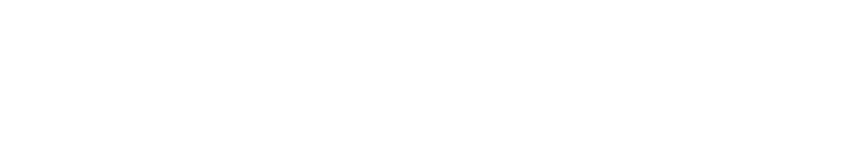
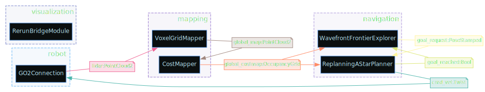

# Go2 Non-ROS Navigation


The Go2 navigation stack runs entirely without ROS. It uses a **column-carving voxel map** strategy: each new LiDAR frame replaces the corresponding region of the global map entirely, ensuring the map always reflects the latest observations.

## Data Flow

<details>
<summary>diagram source</summary>

```pikchr fold output=assets/go2nav_dataflow.svg
color = white
fill = none

Go2: box "Go2" rad 5px fit wid 170% ht 170%
arrow right 0.5in
Vox: box "VoxelGridMapper" rad 5px fit wid 170% ht 170%
arrow right 0.5in
Cost: box "CostMapper" rad 5px fit wid 170% ht 170%
arrow right 0.5in
Nav: box "Navigation" rad 5px fit wid 170% ht 170%

M1: dot at 1/2 way between Go2.e and Vox.w invisible
text "PointCloud2" italic at (M1.x, Go2.n.y + 0.15in)

M2: dot at 1/2 way between Vox.e and Cost.w invisible
text "PointCloud2" italic at (M2.x, Vox.n.y + 0.15in)

M3: dot at 1/2 way between Cost.e and Nav.w invisible
text "OccupancyGrid" italic at (M3.x, Cost.n.y + 0.15in)

arrow dashed from Nav.s down 0.3in then left until even with Go2.s then to Go2.s
M4: dot at 1/2 way between Go2.s and Nav.s invisible
text "Twist" italic at (M4.x, Nav.s.y - 0.45in)
```

</details>

<!--Result:-->

## Pipeline Steps

### 1. LiDAR Frame — [`GO2Connection`](/dimos/robot/unitree/go2/connection.py)

We don't connect to the LiDAR directly — instead we use Unitree's WebRTC client (via [legion's webrtc driver](https://github.com/legion1581/unitree_webrtc_connect)), which streams a heavily preprocessed 5cm voxel grid rather than raw point cloud data. This allows us to support stock, unjailbroken Go2 Air and Pro models out of the box.


### 2. Global Voxel Map — [`VoxelGridMapper`](/dimos/mapping/voxels.py)

The [`VoxelGridMapper`](/dimos/mapping/voxels.py) maintains a sparse 3D occupancy grid using Open3D's `VoxelBlockGrid` backed by a hash map. Each voxel is a 5cm cube by default.

Voxel hash map provides O(1) insert/erase/lookup, so this is efficient even with millions of voxels. The grid runs on **CUDA** by default for speed, with CPU fallback.

Each incoming LiDAR frame is spliced into the global map via column carving. We consider any previously mapped voxels in the space of a received LiDAR frame stale, by erasing entire Z-columns in the footprint, we guarantee:

- No ghost obstacles from previous passes
- Dynamic objects (people, doors) get cleared automatically
- The latest observation always wins

We don't have proper loop closure and stable odometry, we trust the data go2 odom reports, which is surprisingly stable but does drift eventually, You will reliably map and nav through very large spaces (500sqm in our tests) but you won't go down the street to a super market.


#### Configuration

| Parameter          | Default   | Description                                             |
|--------------------|-----------|---------------------------------------------------------|
| `voxel_size`       | 0.05      | Voxel cube size in meters                               |
| `block_count`      | 2,000,000 | Max voxels in hash map                                  |
| `device`           | `CUDA:0`  | Compute device (`CUDA:0` or `CPU:0`)                    |
| `carve_columns`    | `true`    | Enable column carving (disable for append-only mapping) |
| `publish_interval` | 0         | Seconds between map publishes (0 = every frame)         |


### 3. Global Costmap — [`CostMapper`](/dimos/mapping/costmapper.py)

The [`CostMapper`](/dimos/mapping/costmapper.py) converts the 3D voxel map into a 2D occupancy grid. The default algorithm (`height_cost`) maps rate of change of Z, with some smoothing.

algo settings are in [`occupancy.py`](/dimos/mapping/pointclouds/occupancy.py) and can be configured per robot


#### Configuration

```python skip
@dataclass(frozen=True)
class HeightCostConfig(OccupancyConfig):
    """Config for height-cost based occupancy (terrain slope analysis)."""
    can_pass_under: float = 0.6
    can_climb: float = 0.15
    ignore_noise: float = 0.05
    smoothing: float = 1.0
```

| Cost | Meaning                                                  |
|------|----------------------------------------------------------|
| 0    | Flat, easy to traverse                                   |
| 50   | Moderate slope (~7.5cm rise per cell in case of go2)     |
| 100  | Steep or impassable (≥15cm rise per cell in case of go2) |
| -1   | Unknown (no observations)                                |


### 4. Navigation Costmap — [`ReplanningAStarPlanner`](/dimos/navigation/replanning_a_star/module.py)

The planner will process the terrain gradient and compute it's own algo-relevant costmap, prioritizing safe free paths, while be willing to path aggressively through tight spaces if it has to

We run the planner in a constant loop so it will dynamically react to obstacles encountered.


### 5. All Layers Combined

All visualization layers shown together


## Blueprint Composition

The navigation stack is composed in the [`unitree_go2`](/dimos/robot/unitree/go2/blueprints/__init__.py) blueprint:

```python fold output=assets/go2_blueprint.svg
from dimos.core.blueprints import autoconnect
from dimos.core.introspection import to_svg
from dimos.mapping.costmapper import cost_mapper
from dimos.mapping.voxels import voxel_mapper
from dimos.navigation.frontier_exploration import wavefront_frontier_explorer
from dimos.navigation.replanning_a_star.module import replanning_a_star_planner
from dimos.robot.unitree.go2.blueprints.basic.unitree_go2_basic import unitree_go2_basic

unitree_go2 = autoconnect(
    unitree_go2_basic,                    # robot connection + visualization
    voxel_mapper(voxel_size=0.05),        # 3D voxel mapping
    cost_mapper(),                        # 2D costmap generation
    replanning_a_star_planner(),          # path planning
    wavefront_frontier_explorer(),        # exploration
).global_config(n_dask_workers=6, robot_model="unitree_go2")

to_svg(unitree_go2, "assets/go2_blueprint.svg")
```

<!--Result:-->

