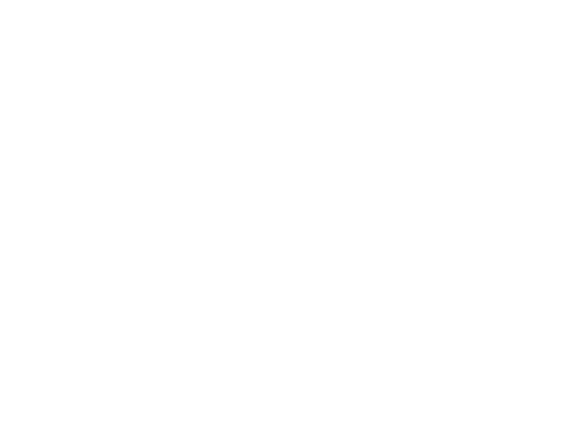

# Docker Images

Dimos uses parallel Docker image hierarchies for ROS and non-ROS builds, allowing you to choose the environment that fits your use case.

## Image Hierarchy

<details><summary>Pikchr</summary>

```pikchr fold output=assets/docker-hierarchy.svg
color = white
fill = none

# Base images
U1: box "ubuntu:22.04" rad 5px fit wid 170% ht 170%
U2: box "ubuntu:22.04" rad 5px fit wid 170% ht 170% at (U1.x + 2.5in, U1.y)

# Labels
text "Non-ROS Track" at (U1.x, U1.y + 0.5in)
text "ROS Track" at (U2.x, U2.y + 0.5in)

# Non-ROS track
arrow from U1.s down 0.4in
P: box "python" rad 5px fit wid 170% ht 170%
arrow from P.s down 0.4in
D: box "dev" rad 5px fit wid 170% ht 170%

# ROS track
arrow from U2.s down 0.4in
R: box "ros" rad 5px fit wid 170% ht 170%
arrow from R.s down 0.4in
RP: box "ros-python" rad 5px fit wid 170% ht 170%
arrow from RP.s down 0.4in
RD: box "ros-dev" rad 5px fit wid 170% ht 170%

# Cross-reference: same dockerfiles reused
line dashed from P.e right 0.3in then down until even with RP then right to RP.w
line dashed from D.e right 0.3in then down until even with RD then right to RD.w
text "same dockerfiles" at (D.e.x + 1.2in, D.e.y + 0.4in)
```

</details>

<!--Result:-->



## Images

All images are published to `ghcr.io/dimensionalos/`.

| Image        | Base                        | Purpose                                            |
|--------------|-----------------------------|----------------------------------------------------|
| `python`     | ubuntu:22.04                | Core dimos with Python dependencies, no ROS        |
| `dev`        | python                      | Development environment (editors, git, pre-commit) |
| `ros`        | ubuntu:22.04                | ROS2 Humble with navigation packages               |
| `ros-python` | ros                         | ROS + dimos Python dependencies                    |
| `ros-dev`    | ros-python                  | Full ROS development environment                   |

## Tags

Images are tagged based on the git branch:

| Branch           | Tag                                             |
|------------------|-------------------------------------------------|
| `main`           | `latest`                                        |
| `dev`            | `dev`                                           |
| feature branches | sanitized branch name (e.g., `feature_foo_bar`) |

## When to Use Each Image

### Non-ROS Track (`python` → `dev`)

```sh skip
docker run -it ghcr.io/dimensionalos/dev:latest bash
```

### ROS Track (`ros` → `ros-python` → `ros-dev`)

Use when you need ROS2 integration:
- Robot hardware control via ROS topics
- Navigation stack integration
- ROS message passing between components
- Running ROS tests (`pytest -m ros`)

```sh skip
docker run -it ghcr.io/dimensionalos/ros-dev:latest bash
```

## Local Development

### Building Images Locally

Use the helper script:

```sh skip
./bin/dockerbuild python    # Build python image
./bin/dockerbuild dev       # Build dev image
./bin/dockerbuild ros       # Build ros image
```

## CI/CD Pipeline

The workflow in [`.github/workflows/docker.yml`](/.github/workflows/docker.yml) handles:

1. **Change detection** - Only rebuilds images when relevant files change
2. **Parallel builds** - ROS and non-ROS tracks build independently
3. **Cascade rebuilds** - Changes to base images trigger downstream rebuilds
4. **Test execution** - Tests run in the freshly built images

### Trigger Paths

| Image    | Triggers on changes to                               |
|----------|------------------------------------------------------|
| `ros`    | `docker/ros/**`, workflow files                      |
| `python` | `docker/python/**`, `pyproject.toml`, workflow files |
| `dev`    | `docker/dev/**`                                      |

### Test Jobs

After images build, tests run in parallel:

| Job                     | Image   | Command                   |
|-------------------------|---------|---------------------------|
| `run-tests`             | dev     | `pytest`                  |
| `run-ros-tests`         | ros-dev | `pytest && pytest -m ros` |
| `run-heavy-tests`       | dev     | `pytest -m heavy`         |
| `run-lcm-tests`         | dev     | `pytest -m lcm`           |
| `run-integration-tests` | dev     | `pytest -m integration`   |
| `run-mypy`              | ros-dev | `mypy dimos`              |

## Dockerfile Structure

### Common Patterns

All Dockerfiles accept a `FROM_IMAGE` build arg for flexibility:

```dockerfile skip
ARG FROM_IMAGE=ubuntu:22.04
FROM ${FROM_IMAGE}
```

This allows the same Dockerfile (e.g., `python`) to build on different bases.

### Python Package Installation

Images use [uv](https://github.com/astral-sh/uv) for fast dependency installation:

```dockerfile skip
ENV UV_SYSTEM_PYTHON=1
RUN curl -LsSf https://astral.sh/uv/install.sh | sh
RUN uv pip install '.[misc,cpu,sim,drone,unitree,web,perception,visualization]'
```

### Dev Image Features

The dev image ([`docker/dev/Dockerfile`](/docker/dev/Dockerfile)) adds:
- Git, git-lfs, pre-commit
- Editors (nano, vim)
- tmux with custom config
- Node.js (via nvm)
- Custom bash prompt with version info
- Entrypoint script that sources ROS setup
