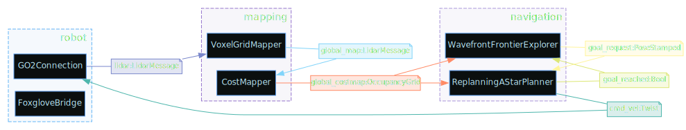
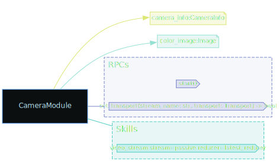
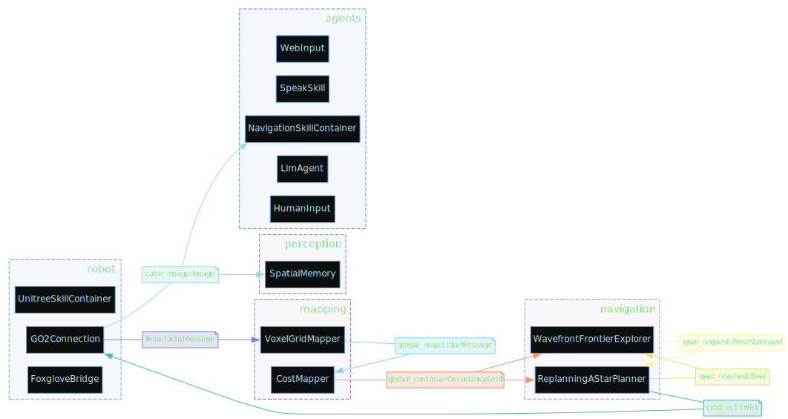

# DimOS Modules

Modules are subsystems on a robot that operate autonomously and communicate with other subsystems using standardized messages.

Some examples of modules are:

- Webcam (outputs image)
- Navigation (inputs a map and a target, outputs a path)
- Detection (takes an image and a vision model like YOLO, outputs a stream of detections)

Below is an example of a structure for controlling a robot. Black blocks represent modules, and colored lines are connections and message types. It's okay if this doesn't make sense now. It will by the end of this document.

```python output=assets/go2_nav.svg
from dimos.core.introspection import to_svg
from dimos.robot.unitree_webrtc.unitree_go2_blueprints import nav
to_svg(nav, "assets/go2_nav.svg")
```

<!--Result:-->


## Camera Module

Let's learn how to build stuff like the above, starting with a simple camera module.

```python session=camera_module_demo output=assets/camera_module.svg
from dimos.hardware.sensors.camera.module import CameraModule
from dimos.core.introspection import to_svg
to_svg(CameraModule.module_info(), "assets/camera_module.svg")
```

<!--Result:-->


We can also print Module I/O quickly to the console via the `.io()` call. We will do this from now on.

```python session=camera_module_demo ansi=false
print(CameraModule.io())
```

<!--Result:-->
```
┌┴─────────────┐
│ CameraModule │
└┬─────────────┘
 ├─ color_image: Image
 ├─ camera_info: CameraInfo
 │
 ├─ RPC start()
 ├─ RPC stop()
 │
 ├─ Skill take_a_picture
```

We can see that the camera module outputs two streams:

- `color_image` with [sensor_msgs.Image](https://docs.ros.org/en/melodic/api/sensor_msgs/html/msg/Image.html) type
- `camera_info` with [sensor_msgs.CameraInfo](https://docs.ros.org/en/melodic/api/sensor_msgs/html/msg/CameraInfo.html) type

It offers two RPC calls: `start()` and `stop()` (lifecycle methods).

It also exposes an agentic [skill](/docs/usage/blueprints.md#defining-skills) called `take_a_picture` (more on skills in the Blueprints guide).

We can start this module and explore the output of its streams in real time (this will use your webcam).

```python session=camera_module_demo ansi=false
import time

camera = CameraModule()
camera.start()
# Now this module runs in our main loop in a thread. We can observe its outputs.

print(camera.color_image)

camera.color_image.subscribe(print)
time.sleep(0.5)
camera.stop()
```

<!--Result:-->
```
Out color_image[Image] @ CameraModule
Image(shape=(480, 640, 3), format=RGB, dtype=uint8, dev=cpu, ts=2025-12-31 15:54:16)
Image(shape=(480, 640, 3), format=RGB, dtype=uint8, dev=cpu, ts=2025-12-31 15:54:16)
Image(shape=(480, 640, 3), format=RGB, dtype=uint8, dev=cpu, ts=2025-12-31 15:54:17)
Image(shape=(480, 640, 3), format=RGB, dtype=uint8, dev=cpu, ts=2025-12-31 15:54:17)
Image(shape=(480, 640, 3), format=RGB, dtype=uint8, dev=cpu, ts=2025-12-31 15:54:17)
Image(shape=(480, 640, 3), format=RGB, dtype=uint8, dev=cpu, ts=2025-12-31 15:54:17)
Image(shape=(480, 640, 3), format=RGB, dtype=uint8, dev=cpu, ts=2025-12-31 15:54:17)
Image(shape=(480, 640, 3), format=RGB, dtype=uint8, dev=cpu, ts=2025-12-31 15:54:17)
Image(shape=(480, 640, 3), format=RGB, dtype=uint8, dev=cpu, ts=2025-12-31 15:54:17)
Image(shape=(480, 640, 3), format=RGB, dtype=uint8, dev=cpu, ts=2025-12-31 15:54:17)
```


## Connecting modules

Let's load a standard 2D detector module and hook it up to a camera.

```python ansi=false session=detection_module
from dimos.perception.detection.module2D import Detection2DModule, Config
print(Detection2DModule.io())
```

<!--Result:-->
```
 ├─ image: Image
┌┴──────────────────┐
│ Detection2DModule │
└┬──────────────────┘
 ├─ detections: Detection2DArray
 ├─ annotations: ImageAnnotations
 ├─ detected_image_0: Image
 ├─ detected_image_1: Image
 ├─ detected_image_2: Image
 │
 ├─ RPC set_transport(stream_name: str, transport: Transport) -> bool
 ├─ RPC start() -> None
 ├─ RPC stop() -> None
```

<!-- TODO: add easy way to print config -->

Looks like the detector just needs an image input and outputs some sort of detection and annotation messages. Let's connect it to a camera.

```python ansi=false
import time
from dimos.perception.detection.module2D import Detection2DModule, Config
from dimos.hardware.sensors.camera.module import CameraModule

camera = CameraModule()
detector = Detection2DModule()

detector.image.connect(camera.color_image)

camera.start()
detector.start()

detector.detections.subscribe(print)
time.sleep(3)
detector.stop()
camera.stop()
```

<!--Result:-->
```
Detection(Person(1))
Detection(Person(1))
Detection(Person(1))
Detection(Person(1))
```

## Distributed Execution

As we build module structures, we'll quickly want to utilize all cores on the machine (which Python doesn't allow as a single process) and potentially distribute modules across machines or even the internet.

For this, we use `dimos.core` and DimOS transport protocols.

Defining message exchange protocols and message types also gives us the ability to write models in faster languages.

## Blueprints

A blueprint is a predefined structure of interconnected modules. You can include blueprints or modules in new blueprints.

A basic Unitree Go2 blueprint looks like what we saw before.

```python  session=blueprints output=assets/go2_agentic.svg
from dimos.core.introspection import to_svg
from dimos.robot.unitree_webrtc.unitree_go2_blueprints import agentic

to_svg(agentic, "assets/go2_agentic.svg")
```

<!--Result:-->



To see more information on how to use Blueprints, see [Blueprints](/docs/usage/blueprints.md).
