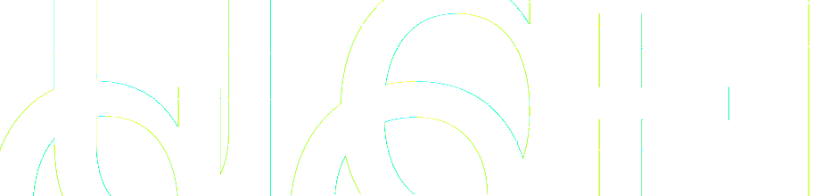

# Transforms

## The Problem: Everything Measures from Its Own Perspective

Imagine your robot has an RGB-D camera—a camera that captures both color images and depth (distance to each pixel). These are common in robotics: Intel RealSense, Microsoft Kinect, and similar sensors.

The camera spots a coffee mug at pixel (320, 240), and the depth sensor says it's 1.2 meters away. You want the robot arm to pick it up—but the arm doesn't understand pixels or camera-relative distances. It needs coordinates in its own workspace: "move to position (0.8, 0.3, 0.1) meters from my base."

To convert camera measurements to arm coordinates, you need to know:
- The camera's intrinsic parameters (focal length, sensor size) to convert pixels to a 3D direction
- The depth value to get the full 3D position relative to the camera
- Where the camera is mounted relative to the arm, and at what angle

This chain of conversions—(pixels + depth) → 3D point in camera frame → robot coordinates—is what **transforms** handle.

<details>
<summary>diagram source</summary>

```pikchr fold output=assets/transforms_tree.svg
color = white
fill = none

# Root (left side)
W: box "world" rad 5px fit wid 170% ht 170%
arrow right 0.4in
RB: box "robot_base" rad 5px fit wid 170% ht 170%

# Camera branch (top)
arrow from RB.e right 0.3in then up 0.4in then right 0.3in
CL: box "camera_link" rad 5px fit wid 170% ht 170%
arrow right 0.4in
CO: box "camera_optical" rad 5px fit wid 170% ht 170%
text "mug here" small italic at (CO.s.x, CO.s.y - 0.25in)

# Arm branch (bottom)
arrow from RB.e right 0.3in then down 0.4in then right 0.3in
AB: box "arm_base" rad 5px fit wid 170% ht 170%
arrow right 0.4in
GR: box "gripper" rad 5px fit wid 170% ht 170%
text "target here" small italic at (GR.s.x, GR.s.y - 0.25in)
```

</details>

<!--Result:-->



Each arrow in this tree is a transform. To get the mug's position in gripper coordinates, you chain transforms through their common parent: camera → robot_base → arm → gripper.

## What's a Coordinate Frame?

A **coordinate frame** is simply a point of view—an origin point and a set of axes (X, Y, Z) from which you measure positions and orientations.

Think of it like giving directions:
- **GPS** says you're at 37.7749° N, 122.4194° W
- The **coffee shop floor plan** says "table 5 is 3 meters from the entrance"
- Your **friend** says "I'm two tables to your left"

These all describe positions in the same physical space, but from different reference points. Each is a coordinate frame.

In a robot:
- The **camera** measures in pixels, or in meters relative to its lens
- The **LIDAR** measures distances from its own mounting point
- The **robot arm** thinks in terms of its base or end-effector position
- The **world** has a fixed coordinate system everything lives in

Each sensor, joint, and reference point has its own frame.

## The Transform Class

The `Transform` class at [`geometry_msgs/Transform.py`](/dimos/msgs/geometry_msgs/Transform.py#L21) represents a spatial transformation with:

- `frame_id` - The parent frame name
- `child_frame_id` - The child frame name
- `translation` - A `Vector3` (x, y, z) offset
- `rotation` - A `Quaternion` (x, y, z, w) orientation
- `ts` - Timestamp for temporal lookups

```python
from dimos.msgs.geometry_msgs import Transform, Vector3, Quaternion

# Camera 0.5m forward and 0.3m up from base, no rotation
camera_transform = Transform(
    translation=Vector3(0.5, 0.0, 0.3),
    rotation=Quaternion(0.0, 0.0, 0.0, 1.0),  # Identity rotation
    frame_id="base_link",
    child_frame_id="camera_link",
)
print(camera_transform)
```

<!--Result:-->
```
base_link -> camera_link
  Translation: → Vector Vector([0.5 0.  0.3])
  Rotation: Quaternion(0.000000, 0.000000, 0.000000, 1.000000)
```


### Transform Operations

Transforms can be composed and inverted:

```python
from dimos.msgs.geometry_msgs import Transform, Vector3, Quaternion

# Create two transforms
t1 = Transform(
    translation=Vector3(1.0, 0.0, 0.0),
    rotation=Quaternion(0.0, 0.0, 0.0, 1.0),
    frame_id="base_link",
    child_frame_id="camera_link",
)
t2 = Transform(
    translation=Vector3(0.0, 0.5, 0.0),
    rotation=Quaternion(0.0, 0.0, 0.0, 1.0),
    frame_id="camera_link",
    child_frame_id="end_effector",
)

# Compose: base_link -> camera -> end_effector
t3 = t1 + t2
print(f"Composed: {t3.frame_id} -> {t3.child_frame_id}")
print(f"Translation: ({t3.translation.x}, {t3.translation.y}, {t3.translation.z})")

# Inverse: if t goes A -> B, -t goes B -> A
t_inverse = -t1
print(f"Inverse: {t_inverse.frame_id} -> {t_inverse.child_frame_id}")
```

<!--Result:-->
```
Composed: base_link -> end_effector
Translation: (1.0, 0.5, 0.0)
Inverse: camera_link -> base_link
```


### Converting to Matrix Form

For integration with libraries like NumPy or OpenCV:

```python
from dimos.msgs.geometry_msgs import Transform, Vector3, Quaternion

t = Transform(
    translation=Vector3(1.0, 2.0, 3.0),
    rotation=Quaternion(0.0, 0.0, 0.0, 1.0),
)
matrix = t.to_matrix()
print("4x4 transformation matrix:")
print(matrix)
```

<!--Result:-->
```
4x4 transformation matrix:
[[1. 0. 0. 1.]
 [0. 1. 0. 2.]
 [0. 0. 1. 3.]
 [0. 0. 0. 1.]]
```


## Frame IDs in Modules

Modules in DimOS automatically get a `frame_id` property. This is controlled by two config options in [`core/module.py`](/dimos/core/module.py#L78):

- `frame_id` - The base frame name (defaults to the class name)
- `frame_id_prefix` - Optional prefix for namespacing

```python
from dimos.core import Module, ModuleConfig
from dataclasses import dataclass

@dataclass
class MyModuleConfig(ModuleConfig):
    frame_id: str = "sensor_link"
    frame_id_prefix: str | None = None

class MySensorModule(Module[MyModuleConfig]):
    default_config = MyModuleConfig

# With default config:
sensor = MySensorModule()
print(f"Default frame_id: {sensor.frame_id}")

# With prefix (useful for multi-robot scenarios):
sensor2 = MySensorModule(frame_id_prefix="robot1")
print(f"With prefix: {sensor2.frame_id}")
```

<!--Result:-->
```
Default frame_id: sensor_link
With prefix: robot1/sensor_link
```


## The TF Service

Every module has access to `self.tf`, a transform service that:

- **Publishes** transforms to the system
- **Looks up** transforms between any two frames
- **Buffers** historical transforms for temporal queries

The TF service is implemented in [`tf.py`](/dimos/protocol/tf/tf.py) and is lazily initialized on first access.

### Multi-Module Transform Example

This example demonstrates how multiple modules publish and receive transforms. Three modules work together:

1. **RobotBaseModule** - Publishes `world -> base_link` (robot's position in the world)
2. **CameraModule** - Publishes `base_link -> camera_link` (camera mounting position) and `camera_link -> camera_optical` (optical frame convention)
3. **PerceptionModule** - Looks up transforms between any frames

```python ansi=false
import time
import reactivex as rx
from reactivex import operators as ops
from dimos.core import Module, rpc, start
from dimos.msgs.geometry_msgs import Quaternion, Transform, Vector3

class RobotBaseModule(Module):
    """Publishes the robot's position in the world frame at 10Hz."""
    def __init__(self, **kwargs: object) -> None:
        super().__init__(**kwargs)

    @rpc
    def start(self) -> None:
        super().start()

        def publish_pose(_):
            robot_pose = Transform(
                translation=Vector3(2.5, 3.0, 0.0),
                rotation=Quaternion(0.0, 0.0, 0.0, 1.0),
                frame_id="world",
                child_frame_id="base_link",
                ts=time.time(),
            )
            self.tf.publish(robot_pose)

        self._disposables.add(
            rx.interval(0.1).subscribe(publish_pose)
        )

class CameraModule(Module):
    """Publishes camera transforms at 10Hz."""
    @rpc
    def start(self) -> None:
        super().start()

        def publish_transforms(_):
            camera_mount = Transform(
                translation=Vector3(1.0, 0.0, 0.3),
                rotation=Quaternion(0.0, 0.0, 0.0, 1.0),
                frame_id="base_link",
                child_frame_id="camera_link",
                ts=time.time(),
            )
            optical_frame = Transform(
                translation=Vector3(0.0, 0.0, 0.0),
                rotation=Quaternion(-0.5, 0.5, -0.5, 0.5),
                frame_id="camera_link",
                child_frame_id="camera_optical",
                ts=time.time(),
            )
            self.tf.publish(camera_mount, optical_frame)

        self._disposables.add(
            rx.interval(0.1).subscribe(publish_transforms)
        )


class PerceptionModule(Module):
    """Receives transforms and performs lookups."""

    def start(self) -> None:
        # This is just to init the transforms system.
        # Touching the property for the first time enables the system for this module.
        # Transform lookups normally happen in fast loops in IRL modules.
        _ = self.tf

    @rpc
    def lookup(self) -> None:

        # Will pretty-print information on transforms in the buffer
        print(self.tf)

        direct = self.tf.get("world", "base_link")
        print(f"Direct: robot is at ({direct.translation.x}, {direct.translation.y})m in world\n")

        # Chained lookup - automatically composes world -> base -> camera -> optical
        chained = self.tf.get("world", "camera_optical")
        print(f"Chained: {chained}\n")

        # Inverse lookup - automatically inverts direction
        inverse = self.tf.get("camera_optical", "world")
        print(f"Inverse: {inverse}\n")

        print("Transform tree:")
        print(self.tf.graph())


if __name__ == "__main__":
    dimos = start(3)

    # Deploy and start modules
    robot = dimos.deploy(RobotBaseModule)
    camera = dimos.deploy(CameraModule)
    perception = dimos.deploy(PerceptionModule)

    robot.start()
    camera.start()
    perception.start()

    time.sleep(1.0)

    perception.lookup()

    dimos.stop()

```

<!--Result:-->
```
Initialized dimos local cluster with 3 workers, memory limit: auto
2025-12-29T12:47:01.433394Z [info     ] Deployed module.                                             [dimos/core/__init__.py] module=RobotBaseModule worker_id=1
2025-12-29T12:47:01.603269Z [info     ] Deployed module.                                             [dimos/core/__init__.py] module=CameraModule worker_id=0
2025-12-29T12:47:01.698970Z [info     ] Deployed module.                                             [dimos/core/__init__.py] module=PerceptionModule worker_id=2
LCMTF(3 buffers):
  TBuffer(world -> base_link, 10 msgs, 0.90s [2025-12-29 20:47:01 - 2025-12-29 20:47:02])
  TBuffer(base_link -> camera_link, 9 msgs, 0.80s [2025-12-29 20:47:01 - 2025-12-29 20:47:02])
  TBuffer(camera_link -> camera_optical, 9 msgs, 0.80s [2025-12-29 20:47:01 - 2025-12-29 20:47:02])
Direct: robot is at (2.5, 3.0)m in world

Chained: world -> camera_optical
  Translation: → Vector Vector([3.5 3.  0.3])
  Rotation: Quaternion(-0.500000, 0.500000, -0.500000, 0.500000)

Inverse: camera_optical -> world
  Translation: → Vector Vector([ 3.   0.3 -3.5])
  Rotation: Quaternion(0.500000, -0.500000, 0.500000, 0.500000)

Transform tree:
┌─────┐
│world│
└┬────┘
┌▽────────┐
│base_link│
└┬────────┘
┌▽──────────┐
│camera_link│
└┬──────────┘
┌▽─────────────┐
│camera_optical│
└──────────────┘
```


You can also run `foxglove-studio-bridge` in the next terminal (binary provided by DimOS and should be in your Python env) and `foxglove-studio` to view these transforms in 3D. (TODO we need to update this for rerun)


Key points:

- **Automatic broadcasting**: `self.tf.publish()` broadcasts via LCM to all modules
- **Chained lookups**: TF finds paths through the tree automatically
- **Inverse lookups**: Request transforms in either direction
- **Temporal buffering**: Transforms are timestamped and buffered (default 10s) for sensor fusion

The transform tree from the example above, showing which module publishes each transform:

<details>
<summary>diagram source</summary>

```pikchr fold output=assets/transforms_modules.svg
color = white
fill = none

# Frame boxes
W: box "world" rad 5px fit wid 170% ht 170%
A1: arrow right 0.4in
BL: box "base_link" rad 5px fit wid 170% ht 170%
A2: arrow right 0.4in
CL: box "camera_link" rad 5px fit wid 170% ht 170%
A3: arrow right 0.4in
CO: box "camera_optical" rad 5px fit wid 170% ht 170%

# RobotBaseModule box - encompasses world->base_link
box width (BL.e.x - W.w.x + 0.15in) height 0.7in \
    at ((W.w.x + BL.e.x)/2, W.y - 0.05in) \
    rad 10px color 0x6699cc fill none
text "RobotBaseModule" italic at ((W.x + BL.x)/2, W.n.y + 0.25in)

# CameraModule box - encompasses camera_link->camera_optical (starts after base_link)
box width (CO.e.x - BL.e.x + 0.1in) height 0.7in \
    at ((BL.e.x + CO.e.x)/2, CL.y + 0.05in) \
    rad 10px color 0xcc9966 fill none
text "CameraModule" italic at ((CL.x + CO.x)/2, CL.s.y - 0.25in)
```


</details>

<!--Result:-->


# Internals

## Transform Buffer

`self.tf` on module is a transform buffer. This is a standalone class that maintains a temporal buffer of transforms (default 10 seconds) allowing queries at past timestamps, you can use it directly:

```python
from dimos.protocol.tf import TF
from dimos.msgs.geometry_msgs import Transform, Vector3, Quaternion
import time

tf = TF(autostart=False)

# Simulate transforms at different times
for i in range(5):
    t = Transform(
        translation=Vector3(float(i), 0.0, 0.0),
        rotation=Quaternion(0.0, 0.0, 0.0, 1.0),
        frame_id="base_link",
        child_frame_id="camera_link",
        ts=time.time() + i * 0.1,
    )
    tf.receive_transform(t)

# Query the latest transform
result = tf.get("base_link", "camera_link")
print(f"Latest transform: x={result.translation.x}")
print(f"Buffer has {len(tf.buffers)} transform pair(s)")
print(tf)
```

<!--Result:-->
```
Latest transform: x=4.0
Buffer has 1 transform pair(s)
LCMTF(1 buffers):
  TBuffer(base_link -> camera_link, 5 msgs, 0.40s [2025-12-29 18:19:18 - 2025-12-29 18:19:18])
```


This is essential for sensor fusion where you need to know where the camera was when an image was captured, not where it is now.


## Further Reading

For a visual introduction to transforms and coordinate frames:
- [Coordinate Transforms (YouTube)](https://www.youtube.com/watch?v=NGPn9nvLPmg)

For the mathematical foundations, the ROS documentation provides detailed background:

- [ROS tf2 Concepts](http://wiki.ros.org/tf2)
- [ROS REP 103 - Standard Units and Coordinate Conventions](https://www.ros.org/reps/rep-0103.html)
- [ROS REP 105 - Coordinate Frames for Mobile Platforms](https://www.ros.org/reps/rep-0105.html)

See also:
- [Modules](/docs/usage/modules.md) for understanding the module system
- [Configuration](/docs/usage/configuration.md) for module configuration patterns
